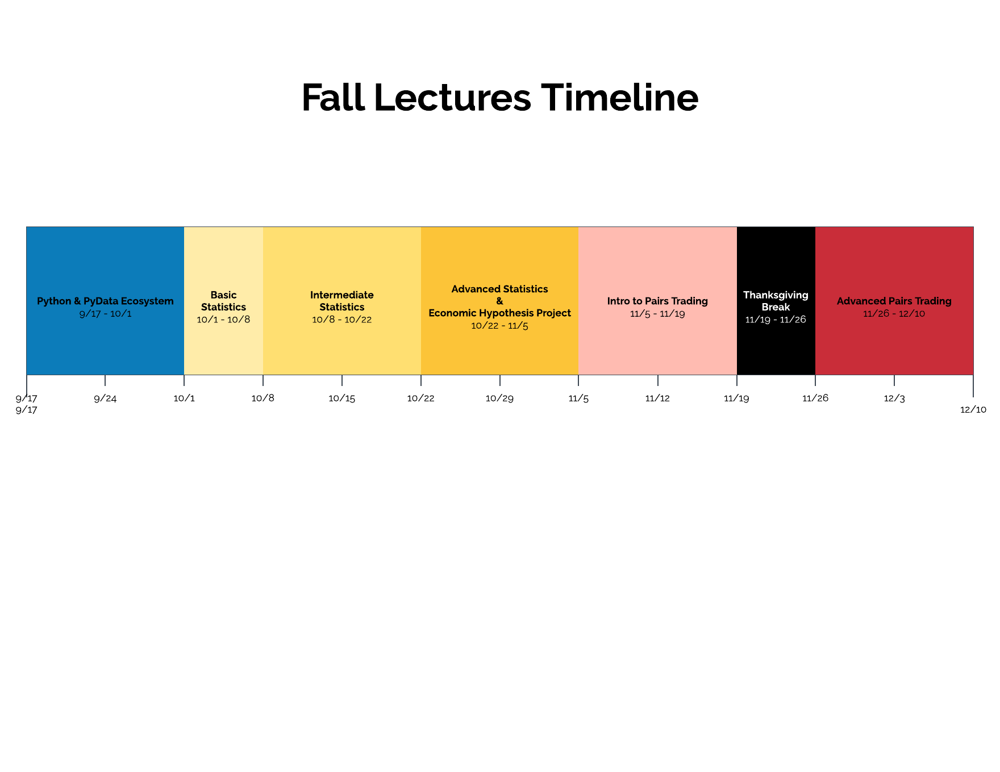

# Fall Schedule

**Summary:** In the fall semester we'll focus on learning commonly used methods in Statistics such as Random Variables, Linear Regression, and Hypothesis Testing, as well as some topics more focused on use in Quant Finance such as Residual Analysis, Spearman Rank Correlation, and Cointegration.

**Goals:** The goals of the semester are to:
  - Learn how to use analyze datasets and develop hypotheses for usage in algorithms
  - Work up to building a Pairs Trading Algorithm
  - Deploy our own Pairs Trading Strategies to [paper trade](https://www.investopedia.com/terms/p/papertrade.asp) into the spring semester

**Projects:** There will be two projects given out
  - Economic Hypothesis Testing
  - Develop a Pairs Trading Algorithm

If there are no Quantopian lectures on a topic, an alternative lecture link is provided.

Week 1
------------------------
**What is Quant Finance?**

**Overview of the Fall Lectures & Goals**

**Python & PyData Ecosystem Part 1**
  - [Intro to the Research Environment](https://www.quantopian.com/lectures/introduction-to-research)
  - [Intro to Python](https://www.quantopian.com/lectures/introduction-to-python)

**Logistics**
  - Make an account on Quantopian if you haven't done so already
  - Sign up for the Slack Chat using your BU email
  - Fill out the survey; sent via Slack

Week 2
------------------------
**Python & PyData Ecosystem Part 2**
  - [Numpy](https://www.quantopian.com/lectures/introduction-to-numpy)

Week 3
---------------------
**Python & PyData Ecosystem Part 3**
  - [Pandas](https://www.quantopian.com/lectures/introduction-to-pandas)
  - [Plotting](https://www.quantopian.com/lectures/plotting-data)

Week 4
--------------------
**Basic Statistics Part 2**
  - [Linear Regression](https://www.quantopian.com/lectures/linear-regression)

**Intermediate Statistics Part 1**
  - [Random Variables](https://www.quantopian.com/lectures/random-variables)

**Bonus:** In your own time; feel free to post questions in Slack
  - [Autocorrelation & AR Models](https://www.quantopian.com/lectures/autocorrelation-and-ar-models)

Week 5
---------------------
**Intermediate Statistics Part 2*
  - [Confidence Intervals](https://www.quantopian.com/lectures/confidence-intervals)
  - [Hypothesis Testing](https://www.quantopian.com/lectures/hypothesis-testing)

**Bonus:** In your own time; feel free to post questions in Slack
  - [Residual Analysis](https://www.quantopian.com/lectures/residual-analysis)
  - [Statistical Moments](https://www.quantopian.com/lectures/statistical-moments)

Week 6
----------------------
**Intermediate Statistics Part 3**
  - [p-Hacking & Multiple Comparisons Bias](https://www.quantopian.com/lectures/p-hacking-and-multiple-comparisons-bias)

Week 7
---------------------
**Advanced Statistics Part 1**
  - [Spearman Rank Correlation](https://www.quantopian.com/lectures/spearman-rank-correlation)
  - [Maximum Likelihood Estimation](https://www.quantopian.com/lectures/maximum-likelihood-estimation)

Week 8
----------------------
**Advanced Statistics Part 2**
  - [Cointegration & Stationarity](https://www.quantopian.com/lectures/integration-cointegration-and-stationarity)

Week 9
-----------------------
**Pairs Trading Part 1**
  - [Pairs Trading Introduction](https://www.quantopian.com/lectures/introduction-to-pairs-trading)
  - Example: Basic Pairs Trading Algorithm

Week 10
-----------------------
**Pairs Trading Part 2**
  - [Advanced Pairs Trading Algorithm](https://www.quantopian.com/lectures/example-pairs-trading-algorithm)
  - Work on building a Pairs Trading Algorithm

Week 11
-----------------------
**What's next and where we're headed for the Spring**

**Continue working on your Pairs Trading Algorithm**