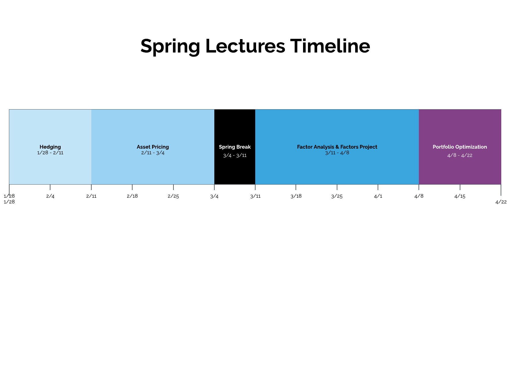

# WORK IN PROGRESS: Spring Schedule

**Summary:** In the spring semester we'll focus on many ideas from [Modern Portfolio Theory](https://en.wikipedia.org/wiki/Modern_portfolio_theory), such as Asset Pricing, Factor Analysis, and Portfolio Optimization.

**Goals:** The goals of the semester are to:
  - Learn how to analyze factors and build models to predict returns
  - Construct optimal portfolios that obey given risk tolerances
  - Deploy our own Long-Short Equity Strategies to [paper trade](https://www.investopedia.com/terms/p/papertrade.asp) into the summer
  - Learn how to analyze the results of backtest

**Projects:** There will be two projects given out
  - Factor Analysis & Alpha Discovery
  - Develop a Long-Short Equity Algorithm

If there are no Quantopian lectures on a topic, an alternative lecture link is provided.

Week 1
------------------------
**Fall Semester Recap**

**Overview of the Spring Lectures & Goals**

**Logistics**
  - Make an account on Quantopian if you haven't done so already
  - Sign up for the Slack Chat using your BU email
  - Fill out the survey; sent via Slack

Week 2
------
**Hedging Part 1**
  - Beta Hedging

**Bonus:**
  - Why You Should Hedge Beta & Sector Exposures Part I**
  - Why You Should Hedge Beta & Sector Exposures Part II**

Week 3
------
**Asset Pricing Part 1**
  - The CAPM & Arbitrage Pricing Theory

Week 4
------
**Asset Pricing Part 2**
  - Fundamental Factor Models

Week 5
------
**Asset Pricing Part 3**
  - Factor Risk Exposure
  - Position Concentration Risk

Week 6
------
**Long-Short Equity**
**Example:** Long-Short Equity Algorithm

Week 7
------
**Factor Analysis**
**Announce Factors Project**

**Case Study:**
  - Traditional Value Factor
	
Week 8
------
**Work on Factors Project**

Week 9
-----
**Work on Factors Project**

Week 10
-------
**Portfolio Optimization Part I**
  - Risk Constrained Portfolio Optimization

Week 11
-------
**Portfolio Optimization Part II**
  - Intro to the Optimize API
